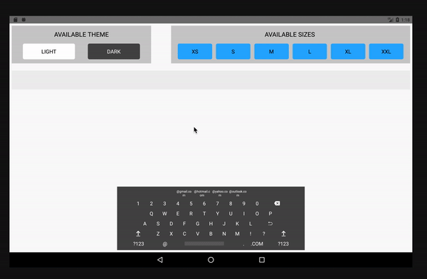

# Setup

This npm can be used to create different sized keyboards for a react-native-project.

## Installation

Use the package manager to install.

```bash
`$ npm install react-native-custom-keyboard --save`
```
 or

```bash
`$ yarn add react-native-custom-keyboard`
```

## Usage

### Props   
##### Props you need to pass while implementing.

| Prop           | Required|     Default     |   Type   | Description                                                                                                 |
| :---------------- | :-------------: | :-------------: | :------: | :---------------------------------------------------------------------------------------------------------- |
| theme     |      False      |     -       |  `String`  | Determines the theme of the keyboard, either 'Dark' or  'Light'.|
| size           |      False       |      -      |  `String`  | Determines the size of the keyboard. |
| input type    |    False      |       -        | `String` | Determines the type of the input you require. Is either 'email' or 'text'.                                                                              |
| onInput         |     True       |      () => {}         | `Function` | Called when there is a text change on keyboard button press. | 
| value        |      True       |      -      | String | The value entered using the keyboard. | 

### Sizes Available
| xsmall         |     small    |   medium   | large                                                                                                |     xlarge    |     xxl    |
| :------------- | :-------------: | :------: | :---------------------------------------------------------------------------------------------------------- |:------------- |:------------- |
### Theme Available
| dark        |     light   |  
| :------------- | :-------------: | 


### Basic
```javascript

import Keyboard from 'react-native-custom-keyboard-mroads';

state = {
  textContent: '',
};

changeTextHandler = value => {
    this.setState({ textContent: value });
  }

function MyKeyboard() {
  return (
    <Keyboard
       onInput={this.changeTextHandler}
       value={this.state.textContent}
    />
   );
 }
```

### Advanced
```javascript

import React from 'react';
import Keyboard from 'react-native-custom-keyboard-mroads';
import { StyleSheet, SafeAreaView, Text, View, } from 'react-native';

class MyKeyboard extends React.Component{

  state = {
  textContent: '',
};

changeTextHandler = value => {
    this.setState({ textContent: value });
}

  render(){

  return (
      <>
        <SafeAreaView>
          <View style={styles.mainView}>
            <View style={styles.keyboardWrapper}>
              <View style={styles.enteredTextContainer}>
                <Text style={styles.enteredText}>{this.state.textContent}</Text>
              </View>
            </View>
            <View style={{ justifyContent: 'flex-end', width: 'auto', height: '65%' }}>
                <Keyboard
                  onInput={this.changeTextHandler}
                  inputType="email"
                  size="xlarge"
                  theme="dark"
                  value={this.state.textContent}
                />
            </View>
          </View>
        </SafeAreaView>
      </>
   );
 }
}

const styles = StyleSheet.create({
  mainView: {height: '100%', justifyContent: 'space-between', alignItems: 'center', padding: 7 },
  keyboardWrapper: { width: '100%', height: '15%' },
  enteredTextContainer: { width: '100%', height: 60, backgroundColor: '#EEEEEE', justifyContent: 'center', alignItems: 'center'}, 
  enteredText: { width: '100%', textAlign: 'center', fontSize: 25},
});

export default MyKeyboard;